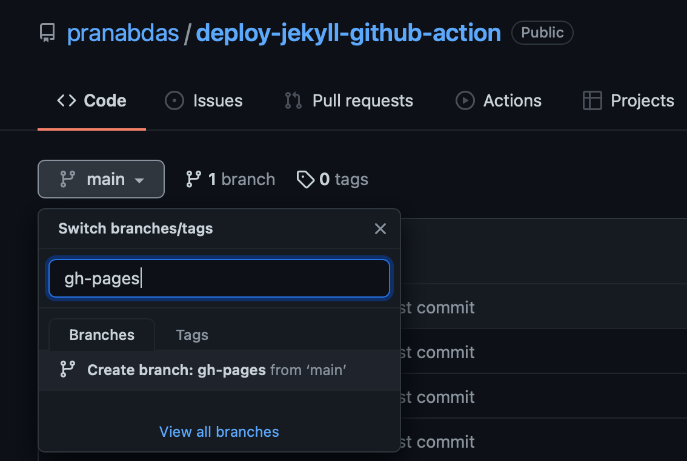
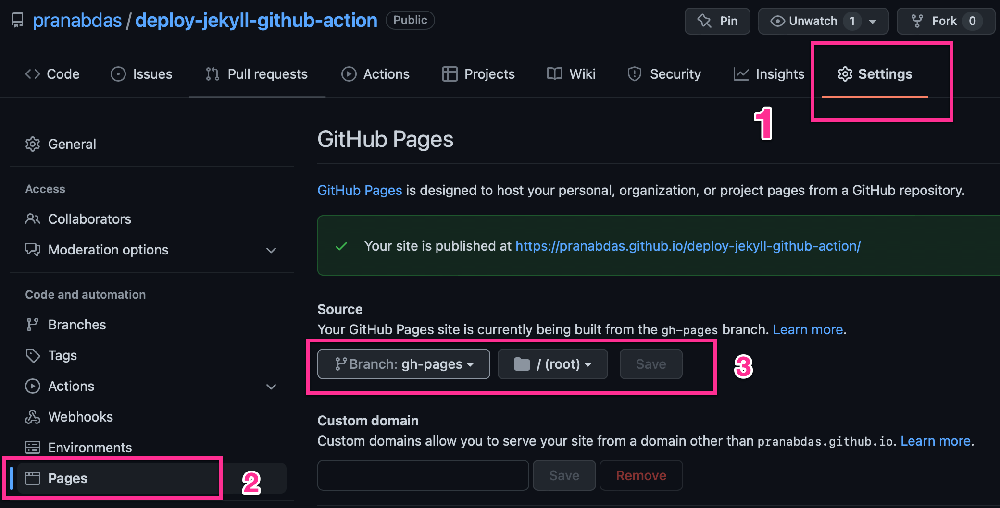

# Deploy Jekyll 4.x.x via GitHub Actions

- Create a brand new Jekyll site:
```console
jekyll new deploy-jekyll-github-action
```

- We need to take care of few things in the `_config.yml` to deploy the site in
GitHub pages. Change the `url` and `baseurl`. In my case:
```yaml
baseurl: "/deploy-jekyll-github-action"
url: "https://pranabdas.github.io"
```

- Let's commit and push the code to github:
```console
git init
git branch -m main
git remote add origin https://github.com/pranabdas/deploy-jekyll-github-action.git
git add --all
git commit -m "first commit"
git push -u origin main
```

- For the first time we will deploy the website via built-in github pages
service. Create a new branch and name it to `gh-pages`.



- This will trigger, github-pages to deploy to
<https://pranabdas.github.io/deploy-jekyll-github-action>. You can head over and
check it out.

- Now let's add our GitHub Actions to deploy automatically, every time we push
out code to `main` branch.

- Create our workflow file:
```console
mkdir -p .github/workflows
vi .github/workflows/deploy-gh-pages.yml
```

- Add following content to our workflow:
```yaml
name: Deploy gh-pages

on:
  push:
    branches:
      - main

jobs:
  deploy:
    runs-on: ubuntu-20.04
    concurrency:
      group: ${{ github.workflow }}-${{ github.ref }}

    steps:
      - uses: actions/checkout@v3

      - name: Prepare Ruby and Jekyll
        uses: ruby/setup-ruby@v1
        with:
          ruby-version: '2.7'

      - name: Install ruby dependencies
        run: bundle install

      - name: Build website
        run: bundle exec jekyll build

      - name: Deploy on gh-pages
        uses: peaceiris/actions-gh-pages@v3
        if: ${{ github.ref == 'refs/heads/main' }}
        with:
          github_token: ${{ secrets.GITHUB_TOKEN }}
          publish_dir: ./_site
          user_name: 'github-actions[bot]'
          user_email: 'github-actions[bot]@users.noreply.github.com'
```

- Commit and push changes to github.

- Note that if GitHub Pages is not already activated, the push from the
workflow to gh-pages branch, won't automatically activate GitHub pages. All you
have to do: go to your repository **Settings** → **Pages**, and select your
source branch and path once the workflow pushed commit to the gh-pages brach.
This is one time settings you need to follow if your GitHub Pages is not set up.
Once GitHub Pages is active, it will deploy subsequent pushes from the workflow
automatically.



- Finally, we will make some changes to our website, and see it automatically
reflects in the automatic deploy. We will add some math equation to our
**about** page.

- In order to parse math equation, we will use `katex` math engine. Add
following to your `_config.yml`:
```yaml
markdown: kramdown
kramdown:
  math_engine: katex
```

- Also we need to add a new **gem** for this. Add `kramdown-math-katex` to the
list of gems in `Gemfile`:
```yaml
group :jekyll_plugins do
  gem "jekyll-feed", "~> 0.12"
  gem "kramdown-math-katex"
end
```

- Run `bundle install` to update `Gemfile.lock`
- Open `about.markdown` and include `katex` stylesheet just below front matter:
```md
---
layout: page
title: About
permalink: /about/
---

<link rel="stylesheet" href="https://cdn.jsdelivr.net/npm/katex@0.15.3/dist/katex.min.css" integrity="sha384-KiWOvVjnN8qwAZbuQyWDIbfCLFhLXNETzBQjA/92pIowpC0d2O3nppDGQVgwd2nB" crossorigin="anonymous">


This is the base Jekyll theme. You can find out more info about customizing your Jekyll theme, as well as basic Jekyll usage documentation at [jekyllrb.com](https://jekyllrb.com/)
```

- Now add some test math equation, in the bottom of about page:
```md
[jekyll-organization]: https://github.com/jekyll

$$
I = \int_0^1 f(x) dx
$$
```

- That's all. Commit and push changes again, and we should see our equation
rendered perfectly [here](
https://pranabdas.github.io/deploy-jekyll-github-action/about/).
